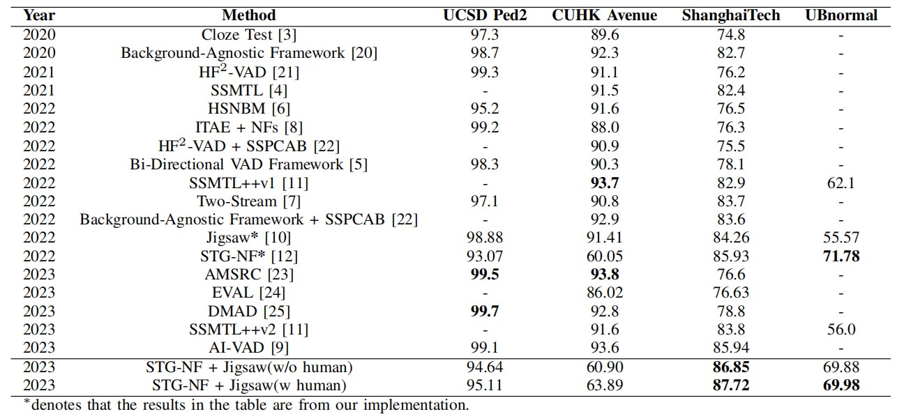

# Divide-and-Conquer

This is the repository for the paper [Divide and Conquer in Video Anomaly Detection: A Comprehensive Review and New Approach](https://arxiv.org/abs/2309.14622).

The experimental code in this paper is based on the code from two papers, [STG-NF](https://github.com/orhir/STG-NF) and [Jigsaw](https://github.com/gdwang08/Jigsaw-VAD). Following the instructions provided in the papers, the replication of the research can be accomplished.

We replicated these two papers on different datasets and attempted the divide-and-conquer approach. The results are as follows:

**As you can see, our results reported a negative outcome, aligning with the spirit of open science.**
